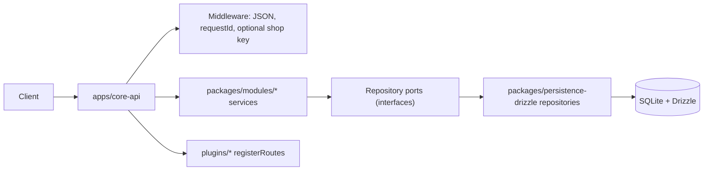

# Cartograph

**Cartograph** is a **commerce platform skeleton**: a monorepo shaped like **Medusa-style modules** plus **Vendure-style plugins**, with a runnable **`core-api`** process, SQLite + **Drizzle** persistence, and stubs for workers, BFFs, and integrations.

It is **not** a turnkey store. It is a **structured place to grow** domain rules, APIs, and integrations without collapsing everything into one Express file.

---

## Table of contents

- [Cartograph](#cartograph)
  - [Table of contents](#table-of-contents)
  - [What you should understand first](#what-you-should-understand-first)
  - [Repository layout](#repository-layout)
  - [How a request flows (mental model)](#how-a-request-flows-mental-model)
  - [The main runtime: `core-api`](#the-main-runtime-core-api)
  - [Domain vs persistence vs plugins](#domain-vs-persistence-vs-plugins)
    - [Domain (`packages/modules`)](#domain-packagesmodules)
    - [Persistence (`packages/persistence-drizzle`)](#persistence-packagespersistence-drizzle)
    - [Plugins (`plugins`)](#plugins-plugins)
  - [Database \& migrations](#database--migrations)
  - [Run locally (minimal path)](#run-locally-minimal-path)
  - [Environment variables](#environment-variables)
  - [Useful HTTP endpoints (overview)](#useful-http-endpoints-overview)
  - [Documentation map](#documentation-map)
  - [How to extend the system](#how-to-extend-the-system)
  - [Common pitfalls](#common-pitfalls)
  - [License / ownership](#license--ownership)

---

## What you should understand first

Three layers:

| Layer | Where | Rule of thumb |
| ----- | ----- | ------------- |
| **HTTP / composition** | `apps/*` | Parses requests, auth headers, wires services to repositories, returns JSON / problem responses. |
| **Domain** | `packages/modules/*` | Business language: cart, catalog, order, tax, … Uses **ports** (interfaces), not SQL. |
| **Infrastructure** | `packages/persistence-drizzle/*`, `plugins/*` | SQL, Stripe, search, etc. Implements ports or registers routes. |

**Golden rule (R-DOM-1 in the spec):** `packages/modules/**` services depend on **repository ports**, not on Drizzle or Express. The app layer (`core-api`) constructs `createXxxRepository(db)` and passes them into `createXxxService({ ... })`.

---

## Repository layout

High-level map (paths are from the **repo root**):

| Path | Purpose |
| ---- | ------- |
| [`apps/core-api/`](apps/core-api/) | Main HTTP API: env, Express app, versioning, health/ready, shop/admin routers, Stripe webhook mount, plugin registration. |
| [`apps/worker/`](apps/worker/) | Background job process (stubs / processors; evolve toward queue consumers). |
| [`apps/admin-bff/`](apps/admin-bff/) · [`apps/storefront-bff/`](apps/storefront-bff/) | Optional BFFs in front of `core-api` or other services. |
| [`packages/domain-contracts/`](packages/domain-contracts/) | Pure types: branded IDs, `Money`, `DomainError`, pagination helpers. **No I/O.** |
| [`packages/modules/`](packages/modules/) | Domain modules: `cart`, `catalog`, `order`, `payment`, `tax`, `inventory`, … — types, services, **ports**. |
| [`packages/persistence-drizzle/`](packages/persistence-drizzle/) | Drizzle schema, SQLite file, **repository implementations** (`createCartRepository`, …). |
| [`packages/kernel/`](packages/kernel/) | Plugin-oriented types (`CommercePlugin`, route context). Full kernel lifecycle is still evolving. |
| [`packages/api-rest/`](packages/api-rest/) · [`packages/api-graphql/`](packages/api-graphql/) | Shared API helpers / GraphQL placeholders. |
| [`packages/events/`](packages/events/) · [`packages/workflows/`](packages/workflows/) | Events, outbox, workflow sketches. |
| [`plugins/`](plugins/) | Swappable integrations (`payment-stripe`, `shipping-flat-rate`, `search-meilisearch`, `core-defaults`). |
| [`docs/`](docs/) | Platform spec, ADRs, runbooks, MVP notes. **`docs/SERIES-B-PLATFORM.md` is the architecture source of truth.** |
| [`tests/`](tests/) | Contract / e2e tests (grow over time). |
| [`scripts/`](scripts/) | e.g. `seed-mvp.ts`, `smoke-mvp.ts` for local demos. |

---

## How a request flows (mental model)



1. **Client** calls `GET /store/v1/...` or `POST /admin/v1/...` (version segment is applied by [`apps/core-api/src/http/versioning.ts`](apps/core-api/src/http/versioning.ts)).
2. **`core-api`** runs middleware (body parsing, **request context** / `X-Request-Id`, optional **shop API key** on mutations).
3. Route handler invokes a **domain service** from `packages/modules`.
4. The service calls a **port**; the **Drizzle repository** behind that port reads/writes SQLite.
5. **Plugins** can add routes via `CommercePlugin.registerRoutes` (see [`packages/kernel/src/plugin.types.ts`](packages/kernel/src/plugin.types.ts) and [`apps/core-api/src/plugins.manifest.ts`](apps/core-api/src/plugins.manifest.ts)).

Errors that are **`DomainError`** are mapped to **`application/problem+json`** (RFC 7807-style) in the global error handler — see [`packages/api-rest/src/problem-json.ts`](packages/api-rest/src/problem-json.ts).

---

## The main runtime: `core-api`

Entry: [`apps/core-api/src/main.ts`](apps/core-api/src/main.ts)

Typical bootstrap order:

1. **`parseEnv`** — validates environment (Zod) in [`apps/core-api/src/config/env.schema.ts`](apps/core-api/src/config/env.schema.ts).
2. **Logger** — JSON-style process logger in [`apps/core-api/src/config/logger.ts`](apps/core-api/src/config/logger.ts); per-request child logger in [`apps/core-api/src/http/request-context.ts`](apps/core-api/src/http/request-context.ts).
3. **SQLite + Drizzle** — `openDrizzleSqlite` from [`packages/persistence-drizzle/src/client.ts`](packages/persistence-drizzle/src/client.ts); `dispose` closes the DB on shutdown.
4. **Plugins** — `loadPlugins({ env, logger })` returns a manifest; each plugin may call `registerRoutes`.
5. **`createApp`** — builds Express, mounts routers, error boundary; see [`apps/core-api/src/app.ts`](apps/core-api/src/app.ts).
6. **`createHttpServer`** — listens after `ready()`; see [`apps/core-api/src/http/server.ts`](apps/core-api/src/http/server.ts).

**Readiness:** `GET /ready` plus `/admin/v1/ready` and `/store/v1/ready` hit [`apps/core-api/src/http/ready.ts`](apps/core-api/src/http/ready.ts) (DB ping).

**Migrations:** optional apply-on-start via Drizzle migrator — [`apps/core-api/src/bootstrap/migrations.ts`](apps/core-api/src/bootstrap/migrations.ts) and the `MIGRATIONS_ON_START` env flag (see env schema).

---

## Domain vs persistence vs plugins

### Domain (`packages/modules`)

- Example: [`packages/modules/cart/cart.service.ts`](packages/modules/cart/cart.service.ts) uses `CartRepositoryPort` + `CatalogRepositoryPort` only.
- **Adding a rule** usually means editing the service, not SQL.

### Persistence (`packages/persistence-drizzle`)

- **Schema:** [`packages/persistence-drizzle/src/schema/`](packages/persistence-drizzle/src/schema/)
- **Repositories:** [`packages/persistence-drizzle/src/repositories/`](packages/persistence-drizzle/src/repositories/)
- **DB file:** default `packages/persistence-drizzle/data.sqlite` (typically gitignored).

### Plugins (`plugins`)

- Example metadata: `plugins/*/plugin.json`.
- Plugins receive a **route context** (admin/shop routers, `asyncHandler`, `db`) so they can mount HTTP without forking `core-api`.

---

## Database & migrations

From the **repository root** [`package.json`](package.json):

| Script | What it does |
| ------ | ------------- |
| `npm run db:push` | Push Drizzle schema to local SQLite (dev convenience). |
| `npm run db:generate` | Generate SQL migrations from schema changes. |
| `npm run db:studio` | Open Drizzle Studio against the configured DB. |
| `npm run db:seed` | Idempotent demo data — see [`scripts/seed-mvp.ts`](scripts/seed-mvp.ts). |

**Authoritative design notes:** [`docs/SERIES-B-PLATFORM.md`](docs/SERIES-B-PLATFORM.md) (persistence, NFRs, module checklist).

---

## Run locally (minimal path)

Prerequisites: **Node 18+**.

```bash
npm ci
npm run db:push
npm run db:seed
npm run dev:api
```

Then:

- Readiness: `GET http://127.0.0.1:3000/ready`
- Smoke (with API running): `npm run smoke` (see [`docs/MVP.md`](docs/MVP.md))

Typecheck (whole monorepo):

```bash
npm run typecheck
```

---

## Environment variables

The **`core-api`** process reads env via [`apps/core-api/src/config/env.schema.ts`](apps/core-api/src/config/env.schema.ts). A practical summary also lives in **[`docs/MVP.md`](docs/MVP.md)** (includes `ADMIN_API_KEY`, `SHOP_API_KEY`, Stripe, CORS).

Notable flags:

| Variable | Role |
| -------- | ---- |
| `NODE_ENV` | `development` / `staging` / `production` — affects defaults (e.g. migrations on start). |
| `PORT` | HTTP port (default `3000`). |
| `DATABASE_PATH` | SQLite path; **required in production** if you follow the schema’s guardrails. |
| `MIGRATIONS_ON_START` | Whether to run SQL migrations during `ready()` (see env schema comments). |
| `PLUGIN_CORE_DEFAULTS_DISABLED` | Skip loading the demo `core-defaults` plugin. |
| `ADMIN_API_KEY` | If set, protects admin-only routes (e.g. `/admin/v1/status`). |
| `SHOP_API_KEY` | If set, shop **mutations** may require a matching header — see MVP doc. |
| `STRIPE_SECRET_KEY` / `STRIPE_WEBHOOK_SECRET` | Optional Stripe payment + webhook path in `core-api`. |

---

## Useful HTTP endpoints (overview)

**Global**

- `GET /ready` — liveness/readiness style probe (DB check).

**Admin (`/admin/v1/...`)**

- `GET /health`, `GET /ready`
- `GET /status` — protected when `ADMIN_API_KEY` is set

**Storefront (`/store/v1/...`)**

- `GET /health`, `GET /ready`
- `GET /catalog/products` — optional `?activeOnly=true`
- `POST /carts` — create empty cart (`sessionId`, `currency` optional)
- `POST /carts/:cartId/lines` — add line (`productId`, `variantId`, `quantity`)
- `POST /orders` — place order from cart (`cartId`)
- Tax: `GET /tax/rates`, `POST /tax/estimate`
- Payments: `GET /orders/:orderId/payments`, `POST /payments`, optional Stripe intent route when configured
- Inventory: `GET /inventory/variants/:variantId/atp`, `POST /inventory/reserve`
- **Plugins** may add more routes under the same mount.

**Webhooks**

- `POST /webhooks/stripe` — registered when `STRIPE_WEBHOOK_SECRET` is set (raw body for signature verification).

Exact wiring lives in [`apps/core-api/src/app.ts`](apps/core-api/src/app.ts).

---

## Documentation map

| Document | Why read it |
| -------- | ----------- |
| [`docs/SERIES-B-PLATFORM.md`](docs/SERIES-B-PLATFORM.md) | Full platform architecture, NFRs (logging, idempotency, outbox, admin vs shop). |
| [`docs/MVP.md`](docs/MVP.md) | Shortest path: DB, seed, run API, smoke, curl examples. |
| [`docs/README.md`](docs/README.md) | Index of ADRs and runbooks. |
| [`docs/adr/`](docs/adr/) | Recorded architectural decisions. |

---

## How to extend the system

**Suggested order when you add a feature:**

1. **Domain** — types + service + port in `packages/modules/<module>/`.
2. **Persistence** — table(s) in `packages/persistence-drizzle/src/schema/`, repository in `repositories/`, export from [`schema/index.ts`](packages/persistence-drizzle/src/schema/index.ts).
3. **HTTP** — thin route in `apps/core-api/src/app.ts` (or a plugin `registerRoutes`).
4. **Tests** — contract or e2e under [`tests/`](tests/).

Most source files include a **Requirements / TODO** header — treat that as the local contract for that file.

---

## Common pitfalls

- **`node_modules` is gitignored** — do not commit dependencies; use lockfile + `npm ci` / `pnpm install` in your environment.
- **`better-sqlite3` is native** — if install scripts were skipped, rebuild or allow postinstall in your package manager.
- **Express 4 + async** — use `asyncHandler` ([`packages/api-rest/src/async-handler.ts`](packages/api-rest/src/async-handler.ts)) so promise rejections reach the error middleware.
- **Spec vs repo** — `docs/SERIES-B-PLATFORM.md` sometimes shows a `platform/` prefix from an older layout; this repo uses root-level `apps/`, `packages/`, `plugins/`.

---

## License / ownership

Private project (`"private": true` in [`package.json`](package.json)). Add a license file if you open-source.
