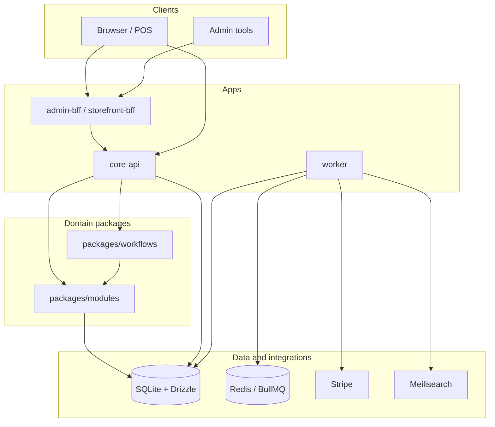
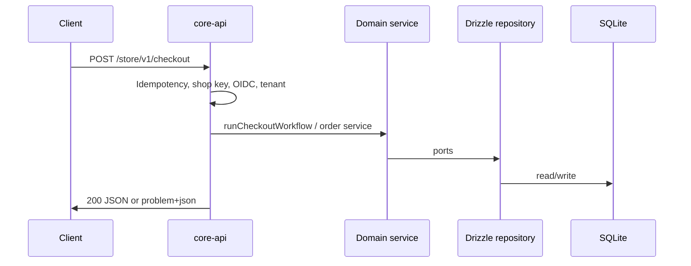

# Cartograph

**Cartograph** is a **commerce platform monorepo**: domain modules (Medusa-style boundaries), a pluggable host (Vendure-style `plugins/`), a runnable **`core-api`**, SQLite + **Drizzle**, background **worker** (outbox, capture, search, logistics hooks), optional **BFFs**, and contract + Playwright tests.

It is a **structured kernel** for carts, catalog, orders, payments, tax, inventory, and integrations—not a turnkey storefront UI.

---

## Table of contents

- [Goals and non-goals](#goals-and-non-goals)
- [Architecture](#architecture)
- [Repository layout](#repository-layout)
- [Runtimes](#runtimes)
- [Request and event flows](#request-and-event-flows)
- [Authentication, tenancy, and RBAC](#authentication-tenancy-and-rbac)
- [Database and migrations](#database-and-migrations)
- [Run locally](#run-locally)
- [Smoke tests](#smoke-tests)
- [Testing and CI](#testing-and-ci)
- [Environment variables](#environment-variables)
- [HTTP surfaces (overview)](#http-surfaces-overview)
- [How to extend](#how-to-extend)
- [Common pitfalls](#common-pitfalls)
- [Further documentation](#further-documentation)
- [Deep-dive questions](#deep-dive-questions)

---

## Goals and non-goals

| Goals | Non-goals |
| ----- | --------- |
| Clear **domain vs infrastructure** split (`packages/modules` → ports → Drizzle) | Full **admin UI** or **storefront** (BFFs are thin shells you can grow) |
| **Admin** vs **store** HTTP surfaces, versioning, problem+json errors | **Production-complete** tax/shipping for every country out of the box |
| **Outbox**, idempotency on mutating shop routes, worker processors | Replacing your **PSP** policy—Stripe/Meili/HTTP carriers are adapters |
| **OIDC/JWT**, API keys, tenant header, RBAC hooks | A single “batteries included” SaaS product |

---

## Architecture

### Layered model

| Layer | Location | Responsibility |
| ----- | -------- | ---------------- |
| **HTTP / composition** | `apps/core-api`, `apps/*-bff` | Routing, validation at the edge, auth middleware, wiring services to repositories, JSON / RFC 7807 errors. |
| **Domain** | `packages/modules/*` | Business language: cart, catalog, order, payment, tax, inventory, fulfillment, … **Ports** (interfaces) only—no SQL. |
| **Orchestration** | `packages/workflows/*` | Checkout, returns, post–order-placed coordination (saga-friendly). |
| **Events** | `packages/events/*` | Outbox enqueue/relay, optional **BullMQ** (`REDIS_URL`). |
| **Infrastructure** | `packages/persistence-drizzle`, `plugins/*` | SQLite schema, repository implementations, Stripe, Meilisearch, flat-rate shipping, etc. |

**Invariant:** domain services depend on **repository ports**, not on Drizzle or Express (see `packages/modules/*/.*.repository.port.ts`).

### Component diagram (high level)



### Repository layout

Paths are from the **repo root** (the long-form spec in `docs/SERIES-B-PLATFORM.md` still uses a historical `platform/` prefix; this tree is what the code uses today).

| Path | Purpose |
| ---- | ------- |
| [`apps/core-api/`](apps/core-api/) | Express app: env, `/admin/v1`, `/store/v1`, plugins, webhooks, metrics/tracing/audit hooks. |
| [`apps/worker/`](apps/worker/) | Periodic ticks + optional BullMQ consumer: outbox dispatch, reservation TTL, payment capture, search index, logistics sync. |
| [`apps/admin-bff/`](apps/admin-bff/) · [`apps/storefront-bff/`](apps/storefront-bff/) | Optional BFFs (proxy patterns; extend as needed). |
| [`packages/domain-contracts/`](packages/domain-contracts/) | Branded IDs, `Money`, `DomainError`, pagination—**no I/O**. |
| [`packages/modules/`](packages/modules/) | Domain modules + `*.repository.port.ts` + services. |
| [`packages/persistence-drizzle/`](packages/persistence-drizzle/) | Drizzle schema, migrations, `create*Repository` factories. |
| [`packages/kernel/`](packages/kernel/) | Plugin types, bootstrap/DI helpers for `CommercePlugin`. |
| [`packages/api-rest/`](packages/api-rest/) | `asyncHandler`, problem JSON, route manifests. |
| [`packages/authz/`](packages/authz/) | Policies, `authorize`, OIDC/JWT verification (`jose`). |
| [`packages/events/`](packages/events/) | Outbox publisher/relay, queue helpers. |
| [`packages/workflows/`](packages/workflows/) | Checkout, return eligibility, order-placed hooks. |
| [`packages/observability/`](packages/observability/) | Metrics, tracing, audit log abstractions. |
| [`plugins/`](plugins/) | `payment-stripe`, `shipping-flat-rate`, `search-meilisearch`, `core-defaults`, … |
| [`tests/contract/`](tests/contract/) | Fast `node:test` contract tests. |
| [`tests/e2e/`](tests/e2e/) | Playwright against `scripts/e2e-server.mjs`. |
| [`scripts/`](scripts/) | `seed-mvp.ts`, `smoke-mvp.ts`, `smoke-with-server.mjs`, `prod-migrate.mjs`, `e2e-server.mjs`. |
| [`docs/`](docs/) | Platform spec, ADRs, runbooks. |
| [`infra/k8s/`](infra/k8s/) | Placeholder for future K8s/Helm notes. |

---

## Runtimes

### `core-api` ([`apps/core-api/src/main.ts`](apps/core-api/src/main.ts))

1. **`parseEnv`** — [`apps/core-api/src/config/env.schema.ts`](apps/core-api/src/config/env.schema.ts) (Zod).
2. **Logger, metrics, tracing, audit log** — wired into `AppContext`.
3. **SQLite** — `openDrizzleSqlite`; optional migrations on start (`MIGRATIONS_ON_START`).
4. **OIDC verifier** — if `OIDC_ISSUER`, `OIDC_AUDIENCE`, `OIDC_JWKS_URL` are all set.
5. **`createApp`** — [`apps/core-api/src/app.ts`](apps/core-api/src/app.ts): rate limit, JSON + **BigInt-safe** `json replacer`, request context, shop/admin routers, idempotency middleware on selected `POST`s.
6. **Plugins** — [`apps/core-api/src/plugins.manifest.ts`](apps/core-api/src/plugins.manifest.ts).
7. **HTTP server** — listen + graceful shutdown.

### `worker` ([`apps/worker/src/main.ts`](apps/worker/src/main.ts))

- **Interval tick** (default `WORKER_TICK_MS`): outbox batch relay, inventory reservation TTL, optional async Stripe capture, search indexing tick.
- **`REDIS_URL` set:** BullMQ **outbox worker** runs handlers that fan out to logistics sync + Meilisearch indexing for each message.
- **Shared `DATABASE_PATH`** with `core-api` in local dev so outbox rows are visible to both processes.

---

## Request and event flows

### HTTP (store example)



### Domain events (outbox)

1. Domain path **enqueues** rows into the outbox (same DB transaction as business writes when implemented that way).
2. **`relayOutboxBatch`** ([`packages/events/src/outbox.relay.ts`](packages/events/src/outbox.relay.ts)): either marks published locally or **pushes jobs to Redis** when `REDIS_URL` is configured.
3. **Worker** consumes jobs and runs **logistics** / **search** processors; periodic tick still drains relay for environments without Redis.

Versioned paths use [`apps/core-api/src/http/versioning.ts`](apps/core-api/src/http/versioning.ts) (`/admin/v1`, `/store/v1`).

---

## Authentication, tenancy, and RBAC

| Mechanism | Usage |
| --------- | ----- |
| **`X-Admin-Key` / `Authorization: Bearer`** | Matches `ADMIN_API_KEY`; sets actor to **admin** for protected admin routes. |
| **`X-Shop-Key` / Bearer** | When `SHOP_API_KEY` is set, shop **mutations** require the shared secret. |
| **OIDC JWT** | Optional: if verifier is configured, shop **writes** require a valid token and tenant; integrates with [`packages/authz`](packages/authz). |
| **`X-Tenant-Id`** | Resolved per request (`DEFAULT_TENANT_ID` fallback); required for many admin flows and OIDC shop writes. |
| **`authorize(actorKind, action)`** | [`packages/authz/src/authorize.ts`](packages/authz/src/authorize.ts) + [`policies.ts`](packages/authz/src/policies.ts). |

---

## Database and migrations

| Command | Purpose |
| ------- | ------- |
| `npm run db:push` | Push schema to local SQLite (dev). |
| `npm run db:generate` | Generate SQL migrations from schema drift. |
| `npm run db:migrate` | Production-oriented migrate script — [`scripts/prod-migrate.mjs`](scripts/prod-migrate.mjs). |
| `npm run db:studio` | Drizzle Studio. |
| `npm run db:seed` | Idempotent MVP catalog/stock/tax — [`scripts/seed-mvp.ts`](scripts/seed-mvp.ts). |

Default DB file: `packages/persistence-drizzle/data.sqlite` (see root `.gitignore` for local DB patterns).

**Drizzle + `better-sqlite3`:** mutations inside `db.transaction` use **synchronous** callbacks; avoid `async` transaction bodies (see repositories).

---

## Run locally

**Prerequisites:** Node **18+** (global `fetch` for smoke), `npm ci`.

```bash
npm ci
npm run db:push
npm run db:seed
npm run dev:api
```

- Readiness: `GET http://127.0.0.1:3000/ready` → `200`, body `{ "ok": true, ... }`.
- Optional second terminal: `npm run dev:worker` (same `DATABASE_PATH`; set `REDIS_URL` for queue-backed outbox).

**Typecheck (whole monorepo):**

```bash
npm run typecheck
```

---

## Smoke tests

| Script | When to use |
| ------ | ----------- |
| `npm run smoke` | API already running; hits `/ready`, `/store/v1/health`, catalog. |
| `npm run smoke:deep` | Same, plus **strict seed** check and **checkout** flow (needs seeded DB; align `SMOKE_SHOP_KEY` / tenant with server). |
| `npm run smoke:local` | **One shot:** isolated DB under `tests/smoke/`, push + seed + temporary API + smoke (see [`scripts/smoke-mvp.ts`](scripts/smoke-mvp.ts) header for env vars). |

---

## Testing and CI

| Command | What it runs |
| ------- | ------------- |
| `npm run test:contract` | `node:test` contracts (authz, storefront, orders, queue integration when `REDIS_URL` set, …). |
| `npm run e2e` | Playwright; `playwright.config.ts` starts [`scripts/e2e-server.mjs`](scripts/e2e-server.mjs). |

[`.github/workflows/ci.yml`](.github/workflows/ci.yml): **Redis** service, `npm ci`, `typecheck`, `test:contract`, Playwright install + `e2e`.

---

## Environment variables

### `core-api` ([`apps/core-api/src/config/env.schema.ts`](apps/core-api/src/config/env.schema.ts))

| Variable | Role |
| -------- | ---- |
| `NODE_ENV` | `development` \| `staging` \| `production` — migrations default, `DATABASE_PATH` required in prod. |
| `PORT` | HTTP port (default `3000`). |
| `DATABASE_PATH` | SQLite path. |
| `MIGRATIONS_ON_START` | Run SQL migrations during startup (`1`/`true` or `0`/`false`; default on in development only). |
| `ADMIN_API_KEY` | Protects admin routes such as `GET /admin/v1/status`. |
| `SHOP_API_KEY` | When set, shop **mutations** require matching header/Bearer. |
| `DEFAULT_TENANT_ID` | Fallback when `X-Tenant-Id` is absent. |
| `OIDC_ISSUER` / `OIDC_AUDIENCE` / `OIDC_JWKS_URL` | Optional JWT verification; all three required to enable verifier. |
| `REDIS_URL` | BullMQ outbox relay from API. |
| `MEILI_URL` / `MEILI_KEY` | Meilisearch (plugins + worker indexing). |
| `SHIPPING_API_KEY` | HTTP carrier / logistics integration. |
| `STRIPE_SECRET_KEY` / `STRIPE_WEBHOOK_SECRET` | Payments + webhook (raw body for signature). |
| `CORS_ORIGIN` | Single allowed origin for CORS middleware. |
| `PROMOTION_DISCOUNT_BPS` | Shop-wide discount in basis points. |
| `RATE_LIMIT_PER_MINUTE` | Per-IP limit (`0` disables). |
| `PLUGIN_CORE_DEFAULTS_DISABLED` | Skip demo plugin. |
| `FEATURE_CHECKOUT_V2` / `FEATURE_ASYNC_CAPTURE` | Feature flags consumed via app context. |

### `worker` ([`apps/worker/src/env.ts`](apps/worker/src/env.ts))

| Variable | Role |
| -------- | ---- |
| `DATABASE_PATH` | Same SQLite as API in dev. |
| `WORKER_TICK_MS` | Poll interval (default `2000`). |
| `WORKER_OUTBOX_BATCH` | Batch size for outbox relay tick. |
| `FEATURE_ASYNC_CAPTURE` | When truthy, payment capture tick may call Stripe. |
| `REDIS_URL` | BullMQ consumer for outbox jobs. |
| `STRIPE_SECRET_KEY` | Capture tick. |
| `SHIPPING_API_KEY` | Logistics processor input. |
| `MEILI_URL` / `MEILI_KEY` | Search indexing. |
| `SHIPPING_WEBHOOK_URL` | Optional HTTP target for logistics sync ([`apps/worker/src/processors/logistics-sync.ts`](apps/worker/src/processors/logistics-sync.ts)). |

---

## HTTP surfaces (overview)

**Global**

- `GET /ready` — DB ping (used by probes).

**Store (`/store/v1/...`)**

- `GET /health`, `GET /ready`
- Catalog, carts, lines, **checkout** (`POST /checkout` with reservation payload), orders, payments, tax, inventory, …
- Selected `POST`s use **`Idempotency-Key`** and persisted replay ([`apps/core-api/src/http/idempotency-post.ts`](apps/core-api/src/http/idempotency-post.ts)).

**Admin (`/admin/v1/...`)**

- `GET /health`, `GET /ready`
- `GET /status` when `ADMIN_API_KEY` is configured
- User management, cost intake, return eligibility, … (many routes require **tenant** + RBAC)

**Webhooks**

- `POST /webhooks/stripe` when webhook secret is set (must receive **raw** body for signature verification).

Exact route list: [`apps/core-api/src/app.ts`](apps/core-api/src/app.ts) and plugin `registerRoutes`.

---

## How to extend

1. **Domain** — types + `*Service` + `*.repository.port.ts` in `packages/modules/<module>/`.
2. **Persistence** — schema + repository in `packages/persistence-drizzle/`.
3. **HTTP** — thin handlers in `app.ts` or a new **`CommercePlugin`**.
4. **Tests** — contract under `tests/contract/`, HTTP flows under `tests/e2e/`.

Source file headers often cite requirements (e.g. R-NF-*)—treat them as local contracts.

---

## Common pitfalls

- **`better-sqlite3` is native** — ensure install scripts run in CI/containers.
- **Express async** — use [`asyncHandler`](packages/api-rest/src/async-handler.ts) so rejections reach the error middleware.
- **BigInt in JSON** — Express `json replacer` coerces `bigint` to string; custom stores (idempotency) must do the same.
- **Spec path `platform/`** — `docs/SERIES-B-PLATFORM.md` may say `platform/`; this repo uses root `apps/` and `packages/`.
- **OIDC enabled** — shop writes need a real JWT and tenant; local smoke without IdP should leave OIDC env unset or use `smoke:local` with default API env.

---

## Further documentation

| Document | Contents |
| -------- | -------- |
| [`docs/SERIES-B-PLATFORM.md`](docs/SERIES-B-PLATFORM.md) | Long-form platform spec, NFRs, module checklist (historical `platform/` tree names—map mentally to this repo). |
| [`docs/adr/`](docs/adr/) | Architecture Decision Records (plugins vs modules, outbox/idempotency, …). |
| [`docs/runbooks/`](docs/runbooks/) | Operational notes (payments, inventory). |

---


---

## License / ownership

Private monorepo (`"private": true` in [`package.json`](package.json)). Add a `LICENSE` if you open-source.
