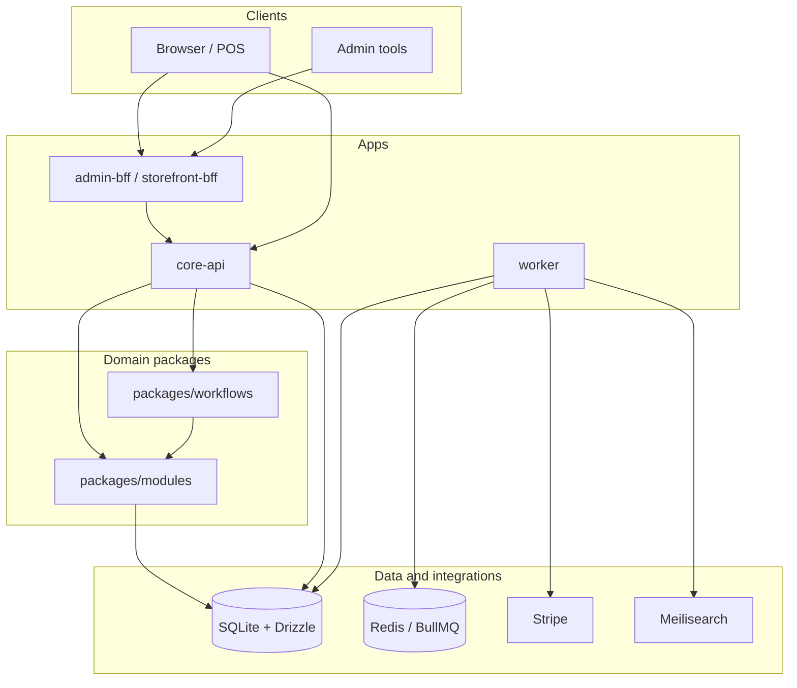
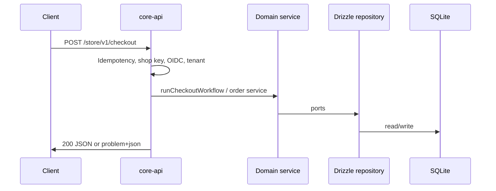

# Cartograph

**Cartograph** is a **commerce platform monorepo**: domain modules (Medusa-style boundaries), a pluggable host (Vendure-style `plugins/`), a runnable **`core-api`**, SQLite + **Drizzle**, background **worker** (outbox, capture, search, logistics hooks), optional **BFFs**, and contract + Playwright tests.

It is a **structured kernel** for carts, catalog, orders, payments, tax, inventory, and integrations—not a turnkey storefront UI.

---

## Table of contents

- [Goals and non-goals](#goals-and-non-goals)
- [Architecture](#architecture)
- [Repository layout](#repository-layout)
- [Runtimes](#runtimes)
- [Request and event flows](#request-and-event-flows)
- [Authentication, tenancy, and RBAC](#authentication-tenancy-and-rbac)
- [Database and migrations](#database-and-migrations)
- [Run locally](#run-locally)
- [Smoke tests](#smoke-tests)
- [Testing and CI](#testing-and-ci)
- [Environment variables](#environment-variables)
- [HTTP surfaces (overview)](#http-surfaces-overview)
- [How to extend](#how-to-extend)
- [Common pitfalls](#common-pitfalls)
- [Further documentation](#further-documentation)
- [Deep-dive questions](#deep-dive-questions)

---

## Goals and non-goals

| Goals | Non-goals |
| ----- | --------- |
| Clear **domain vs infrastructure** split (`packages/modules` → ports → Drizzle) | Full **admin UI** or **storefront** (BFFs are thin shells you can grow) |
| **Admin** vs **store** HTTP surfaces, versioning, problem+json errors | **Production-complete** tax/shipping for every country out of the box |
| **Outbox**, idempotency on mutating shop routes, worker processors | Replacing your **PSP** policy—Stripe/Meili/HTTP carriers are adapters |
| **OIDC/JWT**, API keys, tenant header, RBAC hooks | A single “batteries included” SaaS product |

---

## Architecture

### Layered model

| Layer | Location | Responsibility |
| ----- | -------- | ---------------- |
| **HTTP / composition** | `apps/core-api`, `apps/*-bff` | Routing, validation at the edge, auth middleware, wiring services to repositories, JSON / RFC 7807 errors. |
| **Domain** | `packages/modules/*` | Business language: cart, catalog, order, payment, tax, inventory, fulfillment, … **Ports** (interfaces) only—no SQL. |
| **Orchestration** | `packages/workflows/*` | Checkout, returns, post–order-placed coordination (saga-friendly). |
| **Events** | `packages/events/*` | Outbox enqueue/relay, optional **BullMQ** (`REDIS_URL`). |
| **Infrastructure** | `packages/persistence-drizzle`, `plugins/*` | SQLite schema, repository implementations, Stripe, Meilisearch, flat-rate shipping, etc. |

**Invariant:** domain services depend on **repository ports**, not on Drizzle or Express (see `packages/modules/*/.*.repository.port.ts`).

### Component diagram (high level)



### Repository layout

Paths are from the **repo root** (the long-form spec in `docs/SERIES-B-PLATFORM.md` still uses a historical `platform/` prefix; this tree is what the code uses today).

| Path | Purpose |
| ---- | ------- |
| [`apps/core-api/`](apps/core-api/) | Express app: env, `/admin/v1`, `/store/v1`, plugins, webhooks, metrics/tracing/audit hooks. |
| [`apps/worker/`](apps/worker/) | Periodic ticks + optional BullMQ consumer: outbox dispatch, reservation TTL, payment capture, search index, logistics sync. |
| [`apps/admin-bff/`](apps/admin-bff/) · [`apps/storefront-bff/`](apps/storefront-bff/) | Optional BFFs (proxy patterns; extend as needed). |
| [`packages/domain-contracts/`](packages/domain-contracts/) | Branded IDs, `Money`, `DomainError`, pagination—**no I/O**. |
| [`packages/modules/`](packages/modules/) | Domain modules + `*.repository.port.ts` + services. |
| [`packages/persistence-drizzle/`](packages/persistence-drizzle/) | Drizzle schema, migrations, `create*Repository` factories. |
| [`packages/kernel/`](packages/kernel/) | Plugin types, bootstrap/DI helpers for `CommercePlugin`. |
| [`packages/api-rest/`](packages/api-rest/) | `asyncHandler`, problem JSON, route manifests. |
| [`packages/authz/`](packages/authz/) | Policies, `authorize`, OIDC/JWT verification (`jose`). |
| [`packages/events/`](packages/events/) | Outbox publisher/relay, queue helpers. |
| [`packages/workflows/`](packages/workflows/) | Checkout, return eligibility, order-placed hooks. |
| [`packages/observability/`](packages/observability/) | Metrics, tracing, audit log abstractions. |
| [`plugins/`](plugins/) | `payment-stripe`, `shipping-flat-rate`, `search-meilisearch`, `core-defaults`, … |
| [`tests/contract/`](tests/contract/) | Fast `node:test` contract tests. |
| [`tests/e2e/`](tests/e2e/) | Playwright against `scripts/e2e-server.mjs`. |
| [`scripts/`](scripts/) | `seed-mvp.ts`, `smoke-mvp.ts`, `smoke-with-server.mjs`, `prod-migrate.mjs`, `e2e-server.mjs`. |
| [`docs/`](docs/) | Platform spec, ADRs, runbooks. |
| [`infra/k8s/`](infra/k8s/) | Placeholder for future K8s/Helm notes. |

---

## Runtimes

### `core-api` ([`apps/core-api/src/main.ts`](apps/core-api/src/main.ts))

1. **`parseEnv`** — [`apps/core-api/src/config/env.schema.ts`](apps/core-api/src/config/env.schema.ts) (Zod).
2. **Logger, metrics, tracing, audit log** — wired into `AppContext`.
3. **SQLite** — `openDrizzleSqlite`; optional migrations on start (`MIGRATIONS_ON_START`).
4. **OIDC verifier** — if `OIDC_ISSUER`, `OIDC_AUDIENCE`, `OIDC_JWKS_URL` are all set.
5. **`createApp`** — [`apps/core-api/src/app.ts`](apps/core-api/src/app.ts): rate limit, JSON + **BigInt-safe** `json replacer`, request context, shop/admin routers, idempotency middleware on selected `POST`s.
6. **Plugins** — [`apps/core-api/src/plugins.manifest.ts`](apps/core-api/src/plugins.manifest.ts).
7. **HTTP server** — listen + graceful shutdown.

### `worker` ([`apps/worker/src/main.ts`](apps/worker/src/main.ts))

- **Interval tick** (default `WORKER_TICK_MS`): outbox batch relay, inventory reservation TTL, optional async Stripe capture, search indexing tick.
- **`REDIS_URL` set:** BullMQ **outbox worker** runs handlers that fan out to logistics sync + Meilisearch indexing for each message.
- **Shared `DATABASE_PATH`** with `core-api` in local dev so outbox rows are visible to both processes.

---

## Request and event flows

### HTTP (store example)



### Domain events (outbox)

1. Domain path **enqueues** rows into the outbox (same DB transaction as business writes when implemented that way).
2. **`relayOutboxBatch`** ([`packages/events/src/outbox.relay.ts`](packages/events/src/outbox.relay.ts)): either marks published locally or **pushes jobs to Redis** when `REDIS_URL` is configured.
3. **Worker** consumes jobs and runs **logistics** / **search** processors; periodic tick still drains relay for environments without Redis.

Versioned paths use [`apps/core-api/src/http/versioning.ts`](apps/core-api/src/http/versioning.ts) (`/admin/v1`, `/store/v1`).

---

## Authentication, tenancy, and RBAC

| Mechanism | Usage |
| --------- | ----- |
| **`X-Admin-Key` / `Authorization: Bearer`** | Matches `ADMIN_API_KEY`; sets actor to **admin** for protected admin routes. |
| **`X-Shop-Key` / Bearer** | When `SHOP_API_KEY` is set, shop **mutations** require the shared secret. |
| **OIDC JWT** | Optional: if verifier is configured, shop **writes** require a valid token and tenant; integrates with [`packages/authz`](packages/authz). |
| **`X-Tenant-Id`** | Resolved per request (`DEFAULT_TENANT_ID` fallback); required for many admin flows and OIDC shop writes. |
| **`authorize(actorKind, action)`** | [`packages/authz/src/authorize.ts`](packages/authz/src/authorize.ts) + [`policies.ts`](packages/authz/src/policies.ts). |

---

## Database and migrations

| Command | Purpose |
| ------- | ------- |
| `npm run db:push` | Push schema to local SQLite (dev). |
| `npm run db:generate` | Generate SQL migrations from schema drift. |
| `npm run db:migrate` | Production-oriented migrate script — [`scripts/prod-migrate.mjs`](scripts/prod-migrate.mjs). |
| `npm run db:studio` | Drizzle Studio. |
| `npm run db:seed` | Idempotent MVP catalog/stock/tax — [`scripts/seed-mvp.ts`](scripts/seed-mvp.ts). |

Default DB file: `packages/persistence-drizzle/data.sqlite` (see root `.gitignore` for local DB patterns).

**Drizzle + `better-sqlite3`:** mutations inside `db.transaction` use **synchronous** callbacks; avoid `async` transaction bodies (see repositories).

---

## Run locally

**Prerequisites:** Node **18+** (global `fetch` for smoke), `npm ci`.

```bash
npm ci
npm run db:push
npm run db:seed
npm run dev:api
```

- Readiness: `GET http://127.0.0.1:3000/ready` → `200`, body `{ "ok": true, ... }`.
- Optional second terminal: `npm run dev:worker` (same `DATABASE_PATH`; set `REDIS_URL` for queue-backed outbox).

**Typecheck (whole monorepo):**

```bash
npm run typecheck
```

---

## Smoke tests

| Script | When to use |
| ------ | ----------- |
| `npm run smoke` | API already running; hits `/ready`, `/store/v1/health`, catalog. |
| `npm run smoke:deep` | Same, plus **strict seed** check and **checkout** flow (needs seeded DB; align `SMOKE_SHOP_KEY` / tenant with server). |
| `npm run smoke:local` | **One shot:** isolated DB under `tests/smoke/`, push + seed + temporary API + smoke (see [`scripts/smoke-mvp.ts`](scripts/smoke-mvp.ts) header for env vars). |

---

## Testing and CI

| Command | What it runs |
| ------- | ------------- |
| `npm run test:contract` | `node:test` contracts (authz, storefront, orders, queue integration when `REDIS_URL` set, …). |
| `npm run e2e` | Playwright; `playwright.config.ts` starts [`scripts/e2e-server.mjs`](scripts/e2e-server.mjs). |

[`.github/workflows/ci.yml`](.github/workflows/ci.yml): **Redis** service, `npm ci`, `typecheck`, `test:contract`, Playwright install + `e2e`.

---

## Environment variables

### `core-api` ([`apps/core-api/src/config/env.schema.ts`](apps/core-api/src/config/env.schema.ts))

| Variable | Role |
| -------- | ---- |
| `NODE_ENV` | `development` \| `staging` \| `production` — migrations default, `DATABASE_PATH` required in prod. |
| `PORT` | HTTP port (default `3000`). |
| `DATABASE_PATH` | SQLite path. |
| `MIGRATIONS_ON_START` | Run SQL migrations during startup (`1`/`true` or `0`/`false`; default on in development only). |
| `ADMIN_API_KEY` | Protects admin routes such as `GET /admin/v1/status`. |
| `SHOP_API_KEY` | When set, shop **mutations** require matching header/Bearer. |
| `DEFAULT_TENANT_ID` | Fallback when `X-Tenant-Id` is absent. |
| `OIDC_ISSUER` / `OIDC_AUDIENCE` / `OIDC_JWKS_URL` | Optional JWT verification; all three required to enable verifier. |
| `REDIS_URL` | BullMQ outbox relay from API. |
| `MEILI_URL` / `MEILI_KEY` | Meilisearch (plugins + worker indexing). |
| `SHIPPING_API_KEY` | HTTP carrier / logistics integration. |
| `STRIPE_SECRET_KEY` / `STRIPE_WEBHOOK_SECRET` | Payments + webhook (raw body for signature). |
| `CORS_ORIGIN` | Single allowed origin for CORS middleware. |
| `PROMOTION_DISCOUNT_BPS` | Shop-wide discount in basis points. |
| `RATE_LIMIT_PER_MINUTE` | Per-IP limit (`0` disables). |
| `PLUGIN_CORE_DEFAULTS_DISABLED` | Skip demo plugin. |
| `FEATURE_CHECKOUT_V2` / `FEATURE_ASYNC_CAPTURE` | Feature flags consumed via app context. |

### `worker` ([`apps/worker/src/env.ts`](apps/worker/src/env.ts))

| Variable | Role |
| -------- | ---- |
| `DATABASE_PATH` | Same SQLite as API in dev. |
| `WORKER_TICK_MS` | Poll interval (default `2000`). |
| `WORKER_OUTBOX_BATCH` | Batch size for outbox relay tick. |
| `FEATURE_ASYNC_CAPTURE` | When truthy, payment capture tick may call Stripe. |
| `REDIS_URL` | BullMQ consumer for outbox jobs. |
| `STRIPE_SECRET_KEY` | Capture tick. |
| `SHIPPING_API_KEY` | Logistics processor input. |
| `MEILI_URL` / `MEILI_KEY` | Search indexing. |
| `SHIPPING_WEBHOOK_URL` | Optional HTTP target for logistics sync ([`apps/worker/src/processors/logistics-sync.ts`](apps/worker/src/processors/logistics-sync.ts)). |

---

## HTTP surfaces (overview)

**Global**

- `GET /ready` — DB ping (used by probes).

**Store (`/store/v1/...`)**

- `GET /health`, `GET /ready`
- Catalog, carts, lines, **checkout** (`POST /checkout` with reservation payload), orders, payments, tax, inventory, …
- Selected `POST`s use **`Idempotency-Key`** and persisted replay ([`apps/core-api/src/http/idempotency-post.ts`](apps/core-api/src/http/idempotency-post.ts)).

**Admin (`/admin/v1/...`)**

- `GET /health`, `GET /ready`
- `GET /status` when `ADMIN_API_KEY` is configured
- User management, cost intake, return eligibility, … (many routes require **tenant** + RBAC)

**Webhooks**

- `POST /webhooks/stripe` when webhook secret is set (must receive **raw** body for signature verification).

Exact route list: [`apps/core-api/src/app.ts`](apps/core-api/src/app.ts) and plugin `registerRoutes`.

---

## How to extend

1. **Domain** — types + `*Service` + `*.repository.port.ts` in `packages/modules/<module>/`.
2. **Persistence** — schema + repository in `packages/persistence-drizzle/`.
3. **HTTP** — thin handlers in `app.ts` or a new **`CommercePlugin`**.
4. **Tests** — contract under `tests/contract/`, HTTP flows under `tests/e2e/`.

Source file headers often cite requirements (e.g. R-NF-*)—treat them as local contracts.

---

## Common pitfalls

- **`better-sqlite3` is native** — ensure install scripts run in CI/containers.
- **Express async** — use [`asyncHandler`](packages/api-rest/src/async-handler.ts) so rejections reach the error middleware.
- **BigInt in JSON** — Express `json replacer` coerces `bigint` to string; custom stores (idempotency) must do the same.
- **Spec path `platform/`** — `docs/SERIES-B-PLATFORM.md` may say `platform/`; this repo uses root `apps/` and `packages/`.
- **OIDC enabled** — shop writes need a real JWT and tenant; local smoke without IdP should leave OIDC env unset or use `smoke:local` with default API env.

---

## Further documentation

| Document | Contents |
| -------- | -------- |
| [`docs/SERIES-B-PLATFORM.md`](docs/SERIES-B-PLATFORM.md) | Long-form platform spec, NFRs, module checklist (historical `platform/` tree names—map mentally to this repo). |
| [`docs/adr/`](docs/adr/) | Architecture Decision Records (plugins vs modules, outbox/idempotency, …). |
| [`docs/runbooks/`](docs/runbooks/) | Operational notes (payments, inventory). |

---

## Deep-dive questions

Use these to onboard or interview on the codebase. Answer by reading code—start with [`docs/SERIES-B-PLATFORM.md`](docs/SERIES-B-PLATFORM.md), [`apps/core-api/src/app.ts`](apps/core-api/src/app.ts), [`packages/modules`](packages/modules), [`packages/persistence-drizzle`](packages/persistence-drizzle).

### Architecture and boundaries (1–15)

1. What is the intended split between `packages/modules` (domain) and `packages/persistence-drizzle` (adapter), and where must domain rules *not* live?
2. Why does the repo separate **Shop** vs **Admin** HTTP surfaces under `core-api`?
3. What is the **kernel / plugin** model trying to buy you (Vendure-style) vs a single Express app?
4. How would you trace a request from `apps/core-api/src/main.ts` to a domain `create*Service` call?
5. What is `AppContext` responsible for, and what must *never* be implicit globals?
6. Why is `api-rest` a separate package instead of Express utilities inside `core-api`?
7. What is the long-term job of `packages/workflows` if checkout becomes saga-based?
8. How do `events/` and `outbox` relate to at-least-once delivery, and what is still operationally brittle?
9. What does “services use ports, not Drizzle” imply when someone adds a new table?
10. When would you add a **new app** (e.g. `admin-bff`) vs a new **plugin**?
11. How does the **multi-tenant** hook `resolveTenant` work with `X-Tenant-Id` / `DEFAULT_TENANT_ID`, and what breaks if tenant is null on admin routes?
12. What is the difference between a **port** file and a **service** file in `packages/modules`?
13. Why are ID types “branded” in `domain-contracts` instead of plain `string`?
14. What would break if you passed `AppDb` with the wrong `schema` generic to Drizzle?
15. What is the role of `packages/kernel` relative to `apps/core-api`?

### Domain model and invariants (16–30)

16. How does **Money** avoid floats, and where could rounding still bite you?
17. Why are cart line and order line shapes different, and when are snapshots required?
18. What invariants does inventory service enforce on reserve / commit / release?
19. How can inventory **reserved** and **onHand** get inconsistent if the DB and domain disagree?
20. What is the lifecycle of an `InventoryReservation` status, and which transitions are *not* allowed?
21. How does `PaymentStatus` map to real PSP states (authorized vs captured)?
22. When is `orderId` on a reservation `null`, and how does that interact with the DB FK?
23. How does `TaxService.estimateForCountry` differ from a real nexus/vertex tax engine?
24. What assumptions does catalog `listProducts` make about `activeOnly`?
25. How does `placeFromCart` ensure pricing consistency with catalog at order time?
26. What happens if two requests reserve the last unit concurrently? (What layer should solve it?)
27. Where is **idempotency** for payments intended to live (domain vs API vs provider)?
28. What is the purpose of `DomainError` codes vs free-form error strings?
29. How would you model partial refunds in this payment schema?
30. What would “ATP” (available-to-promise) mean in a multi-warehouse world here?

### Persistence and Drizzle (31–45)

31. Why does `openDrizzleSqlite` create parent directories, and when is that unsafe?
32. What is the contract of `AppDb` with `$client`, and who uses raw `prepare`?
33. Why might both `CREATE TABLE IF NOT EXISTS` patterns and Drizzle migrations appear in the same codebase?
34. How do migrations in `packages/persistence-drizzle/src/migrations` relate to `db:push` in dev?
35. What is the risk of JSON columns (`metadata_json`, `lines`) vs normalized tables?
36. How would you add an index for `payments.provider_ref` at scale?
37. What does `onConflictDoUpdate` assume about primary keys in each repository?
38. Why might SQLite FK enforcement depend on `PRAGMA foreign_keys`?
39. How does the idempotency store guarantee replay safety for duplicate `POST`s?
40. When should you use a transaction across multiple tables vs single-table upsert?
41. How is money represented in SQLite (e.g. text / bigint) end-to-end?
42. What breaks if a repository maps `bigint` incorrectly through `JSON.stringify`?
43. How is `getByProviderRef` used in the Stripe flow, and could duplicates exist?
44. What migration strategy is appropriate for production given push vs migrate paths?
45. How would you test repositories without hitting real SQLite on disk?

### HTTP API, versioning, and plugins (46–60)

46. How does `withApiVersion` shape real URLs (e.g. `/store/v1/...`)?
47. Why must Stripe webhooks be registered with raw body handling before generic `express.json` consumes the body?
48. How does the global `asyncHandler` interact with the error boundary in `app.ts`?
49. What is RFC 7807 doing here, and which errors are *not* `DomainError`?
50. How does the **core-defaults** plugin add routes without editing `app.ts`?
51. When would you disable `core-defaults` in production, and how (`PLUGIN_CORE_DEFAULTS_DISABLED`)?
52. What is the intended difference between `GET /ready` and `GET /health`?
53. How are CORS and auth middleware composed without tangling every route?
54. How does the admin `/status` route differ from public `/admin/v1/health`?
55. What attack surface does shop payments have without end-user auth?
56. How would you structure pagination for `listProducts`?
57. Where is rate limiting applied and how do you disable it?
58. How does request context (`req.requestId`) flow through logging and metrics?
59. How would you add `Deprecation` / `Sunset` headers in practice?
60. What would it take to expose GraphQL from `packages/api-graphql` for real?

### Security and compliance (61–70)

61. How should `ADMIN_API_KEY` be stored and rotated, and what leaks if it appears in logs?
62. What guarantees does Stripe webhook **signature verification** provide?
63. What happens if webhook raw body is parsed as JSON by mistake?
64. How would you prevent someone from creating a payment intent for another shopper’s order?
65. What PII fields exist in the schema, and are they classified in docs?
66. How does env validation in `env.schema.ts` differ between dev and production (`DATABASE_PATH` rule)?
67. How does optional OIDC integrate with shop routes without forking the whole app?
68. What is a threat model for idempotent POST replay vs response tampering?
69. How should secrets for Stripe be scoped (test vs live keys)?
70. What logging must never include (per NFRs) and is that enforced only by convention?

### Operations, worker, and reliability (71–80)

71. What does the worker do on each tick, and how does BullMQ change behavior when `REDIS_URL` is set?
72. How is the **transactional outbox** pattern approximated here, and where could you lose at-most-once vs at-least-once semantics?
73. How should graceful shutdown work with HTTP + SQLite + Redis consumers?
74. How should you run migrations as a release step instead of on boot?
75. How would you observe queue depth and worker failures in production?
76. How would you implement retries with exponential backoff for processors?
77. How does SQLite file locking behave with `better-sqlite3` when API and worker share one file?
78. When would you move from SQLite to Postgres in this design?
79. How would blue/green deploys interact with plugin manifests and schema versions?
80. How meaningful is a DB check in `/ready` vs a lightweight `/health`?

### Code quality, testing, and evolution (81–90)

81. What is the purpose of `tests/contract` vs `tests/e2e`?
82. How would you test that the Stripe webhook updates payment state idempotently?
83. What does `packages/testing` provide for in-memory or fake repositories?
84. How would you use Zod to validate HTTP bodies at the edge given branded IDs in the domain?
85. Where are `TODO`s or stubs still part of the dependency graph risk?
86. What does CI run today, and what would you add for staging gates?
87. How would you evolve ID parsing from unsafe casts to validated branded constructors?
88. What refactors are needed if a second payment provider (e.g. Adyen) is added?
89. How would you document API changes when `/v1` breaks?
90. How would you use feature flags (`FEATURE_CHECKOUT_V2`) safely in the domain layer?

### Product and design rationale (91–100)

91. How close is this repository to a Medusa/Vendure-style **commerce kernel**?
92. What is intentionally **not** built (e.g. storefront UI) and should stay separate?
93. How does a search plugin interact with catalog and worker indexing?
94. How would returns and refunds be modeled on top of current order/payment types?
95. How would promotions plug in without polluting the order line schema?
96. How would you represent multi-currency carts vs single-currency orders?
97. How would subscriptions differ from this one-time payment model?
98. How would B2B pricing (net terms) complicate the current `Payment` model?
99. How would you explain this system to a new senior engineer in 10 minutes using only five files?
100. If you could only complete **one** vertical next (auth hardening, tax provider, or payment capture) to de-risk the business, which would you pick and why?

### Suggested study rhythm

- Pick **one section** per day and answer **10 questions** with file references.
- Re-run after large refactors—answers drift as behavior changes.

---

## License / ownership

Private monorepo (`"private": true` in [`package.json`](package.json)). Add a `LICENSE` if you open-source.
